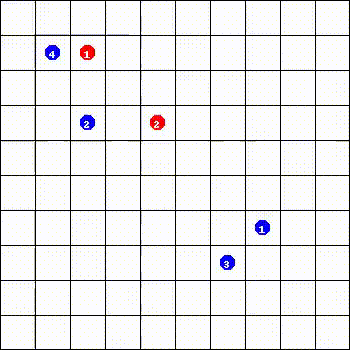

## Multiagent Reinforcement Learning: Rollout and Policy Iteration


Implementation of the Multiagent Rollout
based on the 
paper by Dimitri Bertsekas (2020).


### Environment

Simulation environment follows the rules of the Spiders-and-Flies game as 
specified in [1]. The environment is adapted from Anurag Koul's ma-gym [2] 
modifying the PredatorPrey env.


### Usage

- Install the requirements with `pip`:

```
$ pip install -r requirements.txt
```

- Run the agent simulation from the `scripts` folder:

```
$ python run_agent.py
```

### Results

Baseline Policy (Shortest Distance)        |  Exact Multiagent Rollout     | Approximate Multiagent Rollout     | 
:-------------------------:|:-------------------------:|:-------------------------:|
  |   | |


### References

1. Dimitri Bertsekas - Multiagent Reinforcement Learning: Rollout and 
   Policy Iteration (2020).
   Web: https://web.mit.edu/dimitrib/www/Multiagent_Sinica_2020.pdf
   
2. Anurag Koul - ma-gym: Collection of multi-agent environments based 
   on OpenAI gym (2019). Web: https://github.com/koulanurag/ma-gym
   