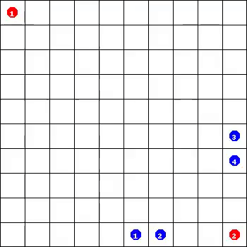

## Multiagent Reinforcement Learning: Rollout and Policy Iteration


Implementation of the Multiagent Rollout
based on the 
paper by Dimitri Bertsekas (2021).


### Environment

Simulation environment follows the rules of the Spiders-and-Flies game as 
specified in [1]. The environment is adapted from Anurag Koul's ma-gym [2] 
modifying the PredatorPrey env.


### Usage

- Install the requirements with `pip`:

```
$ pip install -r requirements.txt
```

- Run the agent simulation from the `scripts` folder:

```
$ python run_agent.py
```

- Run agents' comparison from the `scripts` folder:

```
$ python run_comparison.py
```

### Results

Baseline Policy        |  Standard Rollout     |Agent-by-agent Rollout     |
:-------------------------:|:-------------------------:|:-------------------------:|
  |   | |

Note: Baseline Policy means moving along the shortest path 
to the closest surviving fly.


### References

1. Dimitri Bertsekas - Multiagent Reinforcement Learning: Rollout and 
   Policy Iteration (2021).
   Web: https://ieeexplore.ieee.org/document/9317713
      
2. Anurag Koul - ma-gym: Collection of multi-agent environments based 
   on OpenAI gym (2019). Web: https://github.com/koulanurag/ma-gym
   